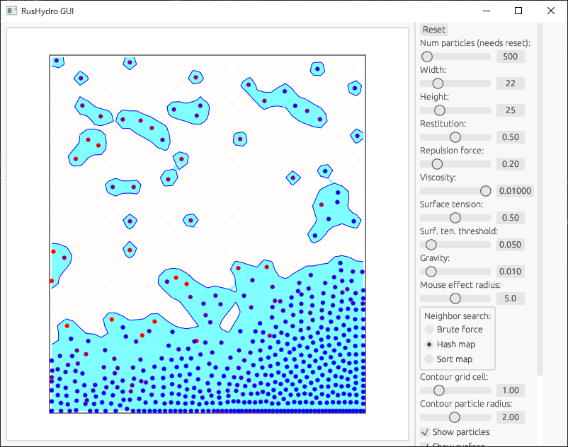

# rushydro

Fluid simulation with particles

Try it on your browser! https://msakuta.github.io/rushydro/



https://github.com/msakuta/rushydro/assets/2798715/97aecdee-ec10-4994-9bd3-7013f273e2cd

https://github.com/msakuta/rushydro/assets/2798715/974de89f-6578-4add-983e-41e4f08c40ff

https://github.com/msakuta/rushydro/assets/2798715/fdc5ebd7-d29e-4fc0-8095-abbb714a95e8


## What is this?

This is a sister project of [cfd-wasm](https://github.com/msakuta/cfd-wasm), a fluid simulator in Rust.
While cfd-wasm used _Eulerian method_ to discretize space, this project uses finite _Lagrangean method_, meaning we track attributes of particles.
It has more advantage that it can calculate varying density like gases or liquid surfaces.

This project has been inspired by [Sebastian Lague's video](https://youtu.be/rSKMYc1CQHE?si=4z0-JIuDQ7tOuDHR),
who did fluid simulation in Unity.
If you can do it in Unity, why not in Rust?


## How to run natively

```
cargo r
```


## How to build a WebAssembly version

Install trunk by 

```
cargo install --locked trunk
```

and run

```
trunk build --release
```

